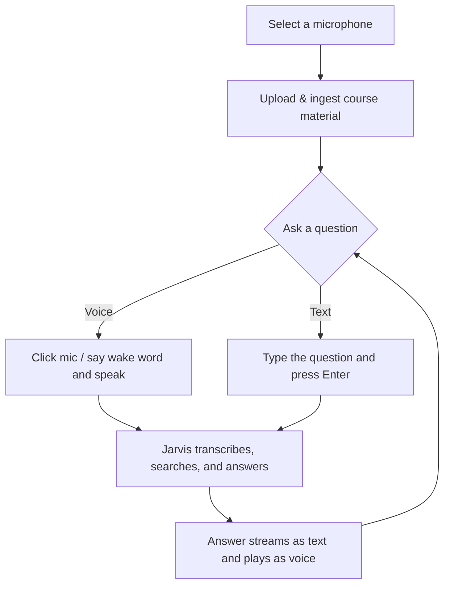

# Application Flow

This guide walks you through the AI Teaching Assistant interface, explains
every UI element, and describes the typical flow of using the application —
from uploading course material to asking questions by voice or text.

Before you begin, make sure the services are running and the UI is open at
`http://127.0.0.1:7860`. See [Get Started](./get-started.md) for setup.

## Screen Layout

The interface is a single screen divided into three columns:

| Column | Contents |
| --- | --- |
| **Left** | Microphone & wake-word controls, Knowledge base, Uploaded files |
| **Center** | Chat conversation ("Jarvis"), status line, text/voice input |
| **Right** | Performance metrics and session timing |

## Typical Flow

The application is designed around one simple loop: **upload material, then
ask questions about it**.

### Step 1 — Choose your microphone

In the **Microphone** dropdown (top of the left column), select the input
device you want to use. The browser asks for microphone permission the first
time; allow it so device names appear. Use the **↻** button to refresh the
list if you plug in a new device.

### Step 2 — Upload course material

Under **Knowledge base**, click **Upload & Ingest** and select one or more
files. The assistant answers only from the material you provide here.

- Supported formats: `.txt`, `.md`, `.docx`, `.pdf`
- Maximum size: 10 MB per file
- You can add more files later; new picks are appended to the existing set

After ingestion completes, a status line shows how many files were ingested
and how many text chunks were created (for example, `2 file(s) ingested · 40
chunks`).

### Step 3 — Ask a question

Once material is ingested, ask a question in one of three ways:

- **Type it** in the text box and press **Enter**.
- **Click the microphone button** and speak; recording stops automatically
  after a short silence, or you can stop it manually.
- **Enable Wake-word mode** and say "hey jarvis" to start a voice session
  hands-free.

### Step 4 — Get the answer

Jarvis transcribes your speech, searches the knowledge base, generates a
grounded answer, and speaks it back while the text streams into the chat.
The status line under the chat reflects each stage.

## UI Elements Reference

### Left Column

#### Microphone selector

- **Microphone dropdown** — Lists available audio input devices. Pick the one
  to capture your voice. Disabled while a recording is in progress.
- **↻ Refresh button** — Re-scans for input devices (use after connecting a
  new microphone).

#### Wake-word mode

- **Wake-word toggle** — When on, the browser microphone continuously listens
  for the wake word "hey jarvis" and opens a voice session automatically when
  it hears it. When off, you start voice sessions manually with the mic button.
- **"Listening for wake word…"** — Shown while the app is armed and waiting
  for the wake word.
- **score** — A live confidence value (0–1) indicating how close the incoming
  audio is to the wake word. It rises as you say "hey jarvis".

#### Knowledge base

- **Upload & Ingest** — Opens the file picker; selected files are uploaded and
  ingested into the knowledge base immediately. Newly picked files are added to
  the existing set (duplicates by name and size are replaced).
- **♻ Re-ingest** — Re-processes the current set of files. Useful to rebuild
  the knowledge base without re-selecting files. Disabled when no files are
  selected.
- **Status line** — Reports ingestion progress, success (files and chunk
  count), or errors (unsupported type, file too large, or a failed file).

#### Uploaded files

- **File list** — Every file that makes up the current knowledge base, with its
  size. A counter shows the total number of files.
- **× Remove button** — Drops a file from the set, re-ingests the remaining
  files so the knowledge base stays in sync, and resets the current
  conversation. If it is the last file, the knowledge base is cleared.
- **"No files uploaded yet."** — Placeholder shown when nothing has been
  ingested.

### Center Column (Chat)

- **Jarvis header** — The assistant's name and avatar ("J").
- **New session** — Clears the current conversation and starts fresh. Disabled
  while recording.
- **Session reset timer** — A small countdown ring that appears after the
  assistant finishes speaking. It auto-starts a new conversation after a period
  of inactivity (paused while recording, processing, or playing a response).
- **Conversation area** — Shows the exchange as chat bubbles: your questions on
  the right, Jarvis's answers on the left. Partial (in-progress) text appears
  dimmed with a blinking cursor. When empty, it shows a greeting and a prompt
  to upload material or ask a question.
- **Dual visualizer** — A single waveform beneath the chat. Your voice peaks
  from the right edge (blue) and the assistant's voice peaks from the left edge
  (green), so you can see who is speaking.
- **Status line** — A live message describing the current stage, such as:
  - `🎙 Listening — speak now`
  - `⏳ Processing speech…`
  - `📝 Searching the knowledge base…`
  - `💬 Generating response…`
  - `🔊 Speaking…`
  - `⏸ Silence detected — auto-stopping...`
  - Errors are prefixed with `❌`.
- **Text input** — Type a question and press **Enter** to send (Shift+Enter for
  a new line). Disabled while a voice session is active.
- **Send button** — Sends the typed question (shown when not recording).
- **Stop button** — Replaces the send button while recording; stops capture and
  begins processing.
- **Microphone button** — Starts a voice session. It pulses and grows with your
  input level while recording. Disabled during wake-word listening or when a
  session is already active.

### Right Column (Metrics)

#### Performance Metrics — Hardware

Live utilization sparklines, each plotted on a 0–100% scale:

- **CPU Usage**
- **GPU Usage**
- **NPU Usage**
- **Memory Usage**

#### Service Latency

Per-request timings for the most recent turn:

- **ASR Latency** — Speech-to-text time.
- **RAG Retrieval** — Time to fetch relevant context chunks.
- **RAG LLM** — Answer generation time.
- **RAG TTFT** — Time to first token from the LLM.
- **TTS Latency** — Speech synthesis time.
- **Tokens/sec** — LLM generation throughput.

#### Session Timing

End-to-end measures for the last voice turn:

- **TTST** — Time to spoken text (until the first audio segment is ready).
- **End-to-End** — Total time from your input to the completed response.
- **RTF** — Real-time factor for the session.

Metric values show `--` until data is available.

## Tips

- The assistant only answers from ingested material. If answers seem off,
  re-check the **Uploaded files** list and **Re-ingest** if needed.
- Use **New session** to clear context before switching topics.
- If the microphone list is empty, grant browser permission and use **↻** to
  refresh.
- To confirm the mic has started listening, watch for the recording red dot in
  the browser tab — it appears while the microphone is active.

## Related Pages

- [Get Started](./get-started.md) — Setup and first run
- [How It Works](./how-it-works.md) — Architecture and data flow
- [Troubleshooting](./troubleshooting.md) — Common issues and solutions
