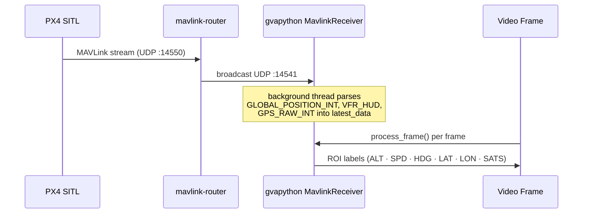

<!--
SPDX-FileCopyrightText: (C) 2026 Intel Corporation
SPDX-License-Identifier: Apache-2.0
-->

# Get Started (Standalone Mode / pymavlink)

This guide provides a step-by-step walkthrough for testing the UAV Vision Analytics application in standalone mode (pymavlink) and running the demo with a simulated UAV camera feed/RealSense cameras.

## How It Works

A self-contained stack. PX4 SITL, MAVLink router, MQTT broker, and Metrics Manager are all started together (`docker-compose-pymavlink.yml`). Telemetry flows from PX4 SITL through `mavlink-router` to the DL Streamer container, where `pymavlink` reads it directly over UDP.


**Telemetry flow:**



**Services:**

| Service | Image | Ports | Role |
| --- | --- | --- | --- |
| `dlstreamer-pipeline-server` | `intel/dlstreamer-pipeline-server` + pymavlink | `8081`, `8555` | AI inference, RTSP output |
| `px4` | `px4io/px4-sitl` | `14550` | Flight controller simulator |
| `mavlink-router` | custom build | `14551` | MAVLink UDP routing (:14550 → :14541) |
| `metrics-manager` | `intel/metrics-manager` | `9090` | CPU/GPU/NPU/power metrics |

---

## Steps to Test the Application

### System Requirements

See [System Requirements](./system-requirements.md) for the full list of software and hardware prerequisites.

### 1. Configure environment

There are two options available to get the application source:

#### Option A — Download the ZIP (recommended)

Download the compressed file and get into the directory:

```bash
curl -OjL https://github.com/open-edge-platform/edge-ai-suites/releases/download/fedaero-latest/uav-mission-apps.zip
```

Decompress the downloaded file:

```bash
unzip uav-mission-apps.zip
cd uav-vision-analytics
```

#### Option B — Clone the whole repository

Clone the repo and get into the directory:

```bash
git clone https://github.com/open-edge-platform/edge-ai-suites.git --branch main
cd edge-ai-suites/federal-and-aerospace-ai-suite/uav-vision-analytics
```

Then, for either option, initialize the environment:

```bash
make init
```

`make init` creates `.env` from the template and **auto-detects your Intel GPU device paths** (`GPU_DEVICE`, `GPU_RENDER_DEVICE`), **Intel NPU** (`NPU_DEVICE`), and **Intel RealSense / USB camera** (`REALSENSE_DEVICE`). It skips if `.env` already exists.

Then set your host IP address in `.env`:

```bash
nano .env   # set HOST_IP=<your-machine-IP>
```

### 2. Prepare the model

Download and export the YOLO11s model to OpenVINO FP16 IR:

```bash
make model
```

> See the [AI Model guide](../how-to-guides/model.md) for model details.

### 3. Standalone mode (pymavlink)

```bash
make pymav-up
```

### 4. Start inference pipelines

Two options are available depending on your use case:

#### Option A — Managed RTSP output (recommended)

Runs `pipeline_manager.py` inside the DLSPS container. It monitors the drone's ARMED/DISARMED state and automatically starts and stops inference pipelines. Annotated frames are served as RTSP on port `8555`.

`make start-rtsp` starts **one device pipeline at a time** (default: GPU). Pass `DEVICE=cpu|gpu|npu|all` to choose:

```bash
make start-rtsp                # GPU only (default)
make start-rtsp DEVICE=cpu     # CPU only
make start-rtsp DEVICE=npu     # NPU only
make start-rtsp DEVICE=all     # CPU + GPU + NPU simultaneously
```

> To arm the drone and trigger streaming, connect with QGroundControl (QGC) and press takeoff — see the [QGroundControl guide](../how-to-guides/qgroundcontrol.md) for setup and connection details. Only the selected `DEVICE` pipeline is active (unless `DEVICE=all`) — see [Step 5 — View the output stream](#5-view-the-output-stream) for the RTSP URLs.

#### Option B — Manual REST API

Start a single pipeline directly without the pipeline manager. Useful for testing individual pipelines or custom configurations.

```bash
# CPU pipeline
INSTANCE_ID=$(curl -s -X POST \
  http://localhost:8081/pipelines/user_defined_pipelines/uav_object_detection_cpu \
  -H "Content-Type: application/json" \
  -d '{
    "destination": {
      "metadata": {
        "type": "file",
        "path": "/tmp/results.jsonl",
        "format": "json-lines"
      },
      "frame": {
        "type": "rtsp",
        "path": "uav-mavlink-cpu"
      }
    },
    "parameters": {
      "detection-properties": {
        "model": "/home/pipeline-server/resources/models/yolo11s/yolo11s_openvino_model/yolo11s.xml",
        "device": "CPU"
      }
    }
  }' | tr -d '"')
echo "Instance ID: $INSTANCE_ID"
```

Change following **three values** to switch between CPU / GPU / NPU:

1. **Pipeline name** in the URL path (`uav_object_detection_cpu` → `_gpu` / `_npu`)
2. **RTSP path** in the request body (`uav-mavlink-cpu` → `uav-mavlink-gpu` / `uav-mavlink-npu`)
3. **Device** in `detection-properties` (`CPU` → `GPU` / `NPU`)

### 5. View the output stream

#### View with ffplay

Install ffmpeg first if not present using `sudo apt install ffmpeg`.

Any of the annotated streams can be viewed with `ffplay <RTSP_PATH>`:

```bash
ffplay rtsp://<HOST_IP>:8555/uav-mavlink-cpu   # CPU
ffplay rtsp://<HOST_IP>:8555/uav-mavlink-gpu   # GPU
ffplay rtsp://<HOST_IP>:8555/uav-mavlink-npu   # NPU
```

The annotated stream includes bounding boxes for detected objects
(person, car, bus, truck, bicycle, and other classes)
and a live telemetry overlay (GPS, altitude, speed, heading).

> **Note — Other ways to view the stream:**
> - Leverage versatile streaming media players such as VLC Player to seamlessly handle, manage, and playback the incoming streams with ease and efficiency.
> - **QGroundControl (QGC)** — connect and view the stream directly in its video panel; see the [QGroundControl guide](../how-to-guides/qgroundcontrol.md#rtsp-stream) for connection details. For the [Step 4](#4-start-inference-pipelines)-Option A flow, connecting QGC and pressing takeoff is arms the drone and triggers the pipeline manager to starts the selected pipeline and serves the RTSP stream once the UAV is armed. If the UAV is armed without a takeoff command, PX4 SITL automatically disarms it again after a few seconds.
> - `DEVICE=npu` requires `NPU_DEVICE` to have been detected during `make init` — falls back to GPU otherwise.

**Stop an individual pipeline** (only needed if you started one manually via Option B in [Step 4](#4-start-inference-pipelines)):

```bash
curl -X DELETE http://localhost:8081/pipelines/${INSTANCE_ID}
```

### 6. Stop all services

Stop and remove the standalone pymavlink stack (also removes named volumes):

```bash
make pymav-down
```

---

## Pipelines

### pymavlink mode (`config-pymavlink.json`)

| Pipeline | Device | Source | Output |
| --- | --- | --- | --- |
| `uav_object_detection_cpu` | CPU | Looped video file (`uav_sample.avi`) | RTSP `:8555` |
| `uav_object_detection_gpu` | GPU | Looped video file (`uav_sample.avi`) | RTSP `:8555` |
| `uav_object_detection_npu` | NPU | Looped video file (`uav_sample.avi`) | RTSP `:8555` |
| `uav_realsense_cpu` | CPU | Intel RealSense camera (v4l2src) | RTSP `:8555` |
| `uav_realsense_gpu` | GPU | Intel RealSense camera (v4l2src) | RTSP `:8555` |
| `uav_realsense_npu` | NPU | Intel RealSense camera (v4l2src) | RTSP `:8555` |

> **Note — Using different or your own aerial footage:** The bundled video `uav_sample.avi` is a placeholder. To see detection on a different aerial footage, replace `uav-vision-analytics/resources/videos/uav_sample.avi` with your own video containing vehicles/pedestrians in appropriate file format (keep the same filename). If the stack is already running with the old video, run [Step 6 — Stop all services](#6-stop-all-services), then restart from [Step 3 — Standalone mode (pymavlink)](#3-standalone-mode-pymavlink) and [Step 4 — Start inference pipelines](#4-start-inference-pipelines) — the file is only read when a pipeline starts.

---

## Telemetry Overlay Fields

Each output frame carries these overlaid fields in the upper-left corner:

| Field | Source MAVLink message | Description |
| --- | --- | --- |
| `Name` | — | Name passed as argument to the gvapython |
| `Frame` | — | Running frame counter |
| `ALT` | `GLOBAL_POSITION_INT.relative_alt` | Relative altitude (m) |
| `SPD` | `VFR_HUD.groundspeed` | Ground speed (m/s) |
| `HDG` | `GLOBAL_POSITION_INT.hdg` | Heading (degrees) |
| `LAT` | `GPS_RAW_INT.lat` | Latitude |
| `LON` | `GPS_RAW_INT.lon` | Longitude |
| `SATS` | `GPS_RAW_INT.satellites_visible` | GPS satellites visible |

---

## Port Reference

| Port | Protocol | Service | Mode |
| --- | --- | --- | --- |
| `8081` | HTTP | DL Streamer REST API | All modes |
| `8555` | RTSP | Annotated video output | All modes |
| `14541` | UDP | MAVLink broadcast (mavlink-router) | pymavlink modes |
| `9090` | HTTP | metrics-manager (HW metrics) | pymavlink modes |

---

## RealSense Camera Support

Intel RealSense camera setup and pipelines details are provided in the [RealSense guide](../how-to-guides/realsense-guide.md).

## Documentation

| Document | Description |
| --- | --- |
| [index.md](../index.md) | Application overview and component block diagrams |
| [benchmark.md](../benchmark.md) | Performance benchmarking guide |
| [makefile.md](../how-to-guides/makefile.md) | Makefile target reference |
| [troubleshooting.md](../how-to-guides/troubleshooting.md) | Known issues and resolutions |
