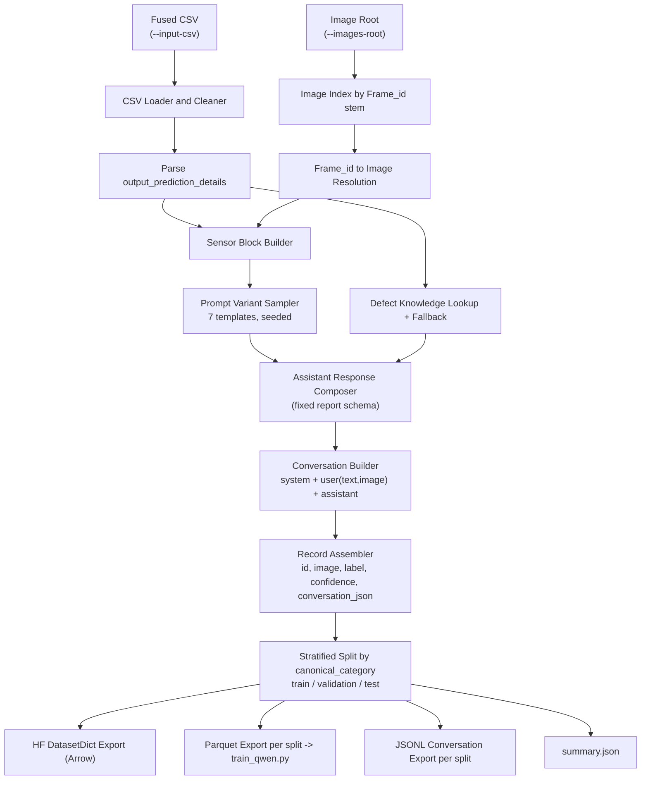

# VLM Fine-Tuning LORA Adapter - Welding Dataset

This section is a concrete, **weld-defect-analysis** instance of the
generic VLM fine-tuning flow using the Unsloth library described in
[`VLM Fine-Tuning with Unsloth Library`](./how-to-fine-tune-vlm.md).

| Generic Stage | Weld-Specific Instance (This Section) |
| --- | --- |
| Bring-your-own dataset, prepared as a parquet file (or files) | `prepare_weld_dataset.py` — [Step 1](#step-1-input-data) & [Step 2](#step-2-prepare-the-dataset) |
| Fine-tune with `train_qwen.py` | Weld-specific invocation — [Step 3](#step-3-fine-tune-the-model-weld-instance) |
| Infer with `infer_qwen.py` | Weld-specific invocation — [Step 4](#step-4-run-inference-weld-instance) |

## Table of Contents

- [Data Preparation Strategy](#data-preparation-strategy)
- [Step 1: Input Data](#step-1-input-data)
- [Step 2: Prepare the Dataset](#step-2-prepare-the-dataset)
- [Step 3: Fine-Tune the Model (Weld Instance)](#step-3-fine-tune-the-model-weld-instance)
- [Step 4: Run Inference (Weld Instance)](#step-4-run-inference-weld-instance)
- [Detailed Data-Preparation Flow](#detailed-data-preparation-flow)
- [Data-Preparation Troubleshooting](#data-preparation-troubleshooting)
- [License and Dataset Attribution](#license-and-dataset-attribution)

## Data Preparation Strategy

### Training Objective

The fine-tuning objective is **not** "describe this image" — it is:

> Given a weld image **and** its corresponding sensor telemetry, produce a
> structured, multi-section quality report: classification (good weld vs.
> one of 11 defect types), a visual observation grounded in the image,
> a sensor-evidence analysis grounded in the telemetry, a confidence and
> defect-probability estimate, a severity rating, a root cause, and
> corrective actions.

This is a **multimodal, structured-output** objective (image and numeric
telemetry in, a fixed-schema text report out), not free-form captioning or
open-ended chat. That objective directly drives every data-preparation
decision that follows:

- **Fixed response schema.** Every assistant response follows the same
  section order: Visual Observation, Model Confidence and Defect Probability, Severity, Root Cause, and
  Corrective Actions. Because the objective is a
  structured report, the model needs to learn the structure as reliably as
  it learns the weld domain. A consistent schema also makes downstream
  parsing of model output straightforward.

- **Prompt diversity, response consistency.** The user prompt text is
  varied across seven phrasings (see
  [Step 2](#step-2-prepare-the-dataset)) so that the model generalizes to
  differently-worded operator questions instead of memorizing one exact
  prompt string, while the assistant response structure stays fixed so
  that the output schema is stable regardless of how the question is
  phrased.

- **Class-balanced splits.** Defect categories are naturally imbalanced,
  with far more good welds than, for example, burn-through. Because the
  objective includes correctly classifying rare defect types, splitting is
  stratified by category, with guardrails for small classes, instead of
  a plain random split, so validation and test sets still exercise every
  defect type.

- **Multimodal alignment.** Because the model must reason jointly over
  pixels and sensor numbers, sensor readings are rendered into the text
  prompt itself, not passed out of band, so the same forward pass that
  attends to the image can also attend to the telemetry text tokens.

In short, the data-preparation stage converts an upstream classifier’s
tabular predictions, raw sensor comma-separated value (CSV) files, and
images into a dataset whose input and output format matches the
structured-report objective. This allows a generic instruction-tuned
VLM base model to be steered toward that objective with a relatively
small amount of LoRA fine-tuning.

## Step 1: Input Data

`prepare_weld_dataset.py` consumes two inputs that you must provide:

1. **A fused CSV file** (`--input-csv`), one row per labeled weld image or sample,
   with these columns at the minimum:

   | Column | Type | Description |
   | --- | --- | --- |
   | `Frame_id` | string | Image filename stem used to resolve the image file under `--images-root` |
   | `output_prediction_details` | Python dictionary literal (string) | Classifier output — see below |
   | `Category` | string | Canonical weld-session label used for stratified splitting (falls back to the parsed `predicted_category` if absent) |
   | `Primary Weld Current`, `Secondary Weld Voltage`, `Pressure`, `CO2 Weld Flow`, `Feed`, `Wire Consumed` | numeric | Sensor telemetry injected into the prompt |

   `output_prediction_details` must parse (via `ast.literal_eval`) into a
   dict shaped like the output of
   [`classification-training`](https://github.com/open-edge-platform/edge-ai-suites/tree/release-2026.2.0/manufacturing-ai-suite/industrial-edge-insights-multimodal/training/classification-training)'s
   `WeldDefectPredictor` — see its
   [Output Format](https://github.com/open-edge-platform/edge-ai-suites/blob/release-2026.2.0/manufacturing-ai-suite/industrial-edge-insights-multimodal/training/classification-training/README.md#output-format)
   section for the exact shape, e.g.:

   ```python
   {
       "predicted_category": "Excessive Penetration",
       "is_defect": True,
       "defect_probability": 1.0,
       "good_weld_probability": 0.0,
       "confidence": 0.9886,
       "explanation": {
           "reason": "...",
           "top_signal_features": [
               {"feature": "Primary Weld Current", "value": 89.06,
                "predicted_mean": 92.1, "good_weld_mean": 60.4,
                "evidence_score": 0.42},
               ...
           ],
       },
   }
   ```

   In practice, this CSV file is produced by fusing:
   - Per-frame classifier predictions (run `classification-training`'s
     inference over your weld image and sensor dataset to get
     `output_prediction_details` per row), with
   - Raw sensor telemetry and image `Frame_id`s, aligned by timestamp.

   This repository does not include a fusion script. Build one for your own data
   pipeline, or provide the CSV file in the schema above directly.

2. **An image root** (`--images-root`): a directory tree of weld images
   (`.jpg`/`.jpeg`/`.png`), searched recursively. Each image's
   filename stem (without extension) must match a `Frame_id` value in the
   CSV file. Sub-folder structure (e.g. per-class folders) does not matter. Only
   the filename stem is used for matching.

You can source the underlying raw images and sensor CSV files for weld defect data from
the same public dataset used by `classification-training`:
[IntelLabs/Intel_Robotic_Welding_Multimodal_Dataset](https://huggingface.co/datasets/IntelLabs/Intel_Robotic_Welding_Multimodal_Dataset).

## Step 2: Prepare the Dataset

```bash
python prepare_weld_dataset.py \
  --input-csv /path/to/merged_by_ts_time.csv \
  --images-root /path/to/dataset/images \
  --output-dir ./processed_dataset \
  --train-ratio 0.8 --val-ratio 0.1 --test-ratio 0.1 \
  --seed 42
```

Useful flags:

- `--limit N` — cap the number of rows processed, for a quick dry-run.
- `--skip-missing` — drop rows whose image cannot be resolved instead of
  raising an error (default: strict, raises on the first missing image).

### Dataset Preparation Script Processing Steps

1. Loads and cleans the CSV file by stripping the whitespace character from
   headers and string fields.
2. Builds an index that maps `Frame_id` values to image paths from
   `--images-root`.
3. Parses `output_prediction_details` per row.
4. Builds a sensor-telemetry text block and randomly picks one of seven user
   prompt templates, using --seed for reproducibility.
5. Synthesizes a structured assistant response in the following order:
   Visual Observation, Model Confidence and Defect Probability, Severity, Root Cause, and
   Corrective actions, drawing on a small built-in defect knowledge base with
   a generic fallback for unseen categories.
6. Assembles a three-turn conversation for each row: system with text content,
   user with text and image content, and assistant with text content.
7. Performs a stratified train, validation, and test split by canonical category,
   so small classes still get at least one sample per
   split when possible.
8. Writes:
   - `hf_dataset/`: an HF `DatasetDict`, with an image column cast to PIL
   - `parquet/{train,validation,test}.parquet`: used by `train_qwen.py`
   - `conversations/{train,validation,test}.jsonl`: raw messages, useful
     for manual inspection or use with other trainers
   - `summary.json`: row counts, missing-image count, and output paths

### Conversation and Prompt Template

Every record is a fixed three-turn chat-format conversation in the order
of `system`, `user`, and `assistant`, matching the chat template expected
by the Qwen-VL model and the Unsloth fine-tuning library during training
and inference:

| Turn | Content | Purpose |
| --- | --- | --- |
| `system` | A fixed "expert weld quality inspector and metallurgical engineer" persona that references AWS D1.1 and ISO 5817 | Anchors the model's domain role and output-structuring behavior consistently across samples |
| `user` | `{one of seven user instruction templates}`, a `{sensor telemetry block}`, and an `{image}` | The operator's question, phrased differently each time, with raw sensor readings inlined as text so the model attends to both modalities together |
| `assistant` | A fixed-schema structured report as described in [Data Preparation Strategy](#data-preparation-strategy), synthesized from classifier output and a small defect knowledge base | The learning target that the model is trained to produce |

There are seven user prompt templates instead of one fixed prompt because
single fixed instruction risks the model overfitting to that exact wording,
meaning that it associates its structured-report behavior with matching
text rather than the actual image and sensor content. Randomly selecting
from seven semantically equivalent but differently worded prompts using
`--seed` for reproducible runs teaches the model that the same structured
analysis is expected regardless of how the user asks.

The sensor block is inlined into the user text rather than passed as
separate structured input because the Qwen-VL model, like most current VLMs,
has two native input channels: image tokens and text tokens. Because the
objective requires reasoning that correlates image content with sensor
readings, the telemetry is included in the same forward pass as the image.
The telemetry is rendered as a `Sensor Data:` text block in the same user
turn as the image.

### Parquet, Arrow, and JSONL Formats and the Format Used by train_qwen.py

`prepare_weld_dataset.py` emits the **same** dataset in the following three
formats, because they serve different consumers:

| Format | Location | Used by | Purpose |
| --- | --- | --- | --- |
| **Arrow** (`hf_dataset/`, written through `DatasetDict.save_to_disk`) | On-disk memory-mapped Arrow tables | Ad-hoc exploration with `datasets.load_from_disk`, or as a base to derive further Hugging Face-native transforms | Arrow is the `datasets` library's native, memory-mapped columnar format. Large image datasets can be inspected and iterated without loading everything into RAM, and the Arrow dataset round-trips through `datasets` APIs (filters, `map`, etc.) losslessly |
| **Parquet** (`parquet/{split}.parquet`) | One portable file per split | **`train_qwen.py`**, via `datasets.load_dataset("parquet", ...)` | Parquet is a compact, columnar, self-contained, widely-portable file format. With the `image` column cast to `datasets.Image`, image bytes are embedded directly in the parquet file, so a single file per split carries both the conversation and its image with no separate file tree to keep in synchronization. Parquet is the standard format used by the Unsloth library, the datasets library, and Hugging Face Hub for VLM datasets. |
| **JSONL** (`conversations/{split}.jsonl`) | One line per record, `{"messages": [...]}` | Manual inspection (`less`, `jq`, diffing) and any other chat-format supervised fine-tuning (SFT) trainer (e.g. axolotl, LLaMA-Factory) that expects JSONL conversations | Human-readable, diffable, and framework-agnostic. No binary or Arrow tooling is needed to inspect a few samples, and it is the lowest-common-denominator format most other SFT trainers already accept. |

**`train_qwen.py` loads the train and validation splits** from the
parquet dataset directory specified by
`--dataset-path ./processed_dataset/parquet`. It uses
`datasets.load_dataset` to provide rows with an `image` column and
a `conversation_json` column, which `common.convert_to_conversation`
converts for training. The Parquet files contain these data in one
file per split. The Arrow dataset in `hf_dataset/` contains the
same processed record fields, while the JSONL export contains only
conversation messages and does not contain image data.

### Motivation Summary

The overall motivation for producing three formats instead of one is:
**author once, consume anywhere**, where the same three-turn conversation,
sensor block, and structured response are computed a single time in
`prepare_weld_dataset.py`, then serialized to whichever format each
downstream consumer (trainer, debugger, or another framework) natively
expects, instead of re-deriving the dataset per consumer.

## Step 3: Fine-Tune the Model (Weld Instance)

`train_qwen.py` is the generic fine-tuning script that uses the Unsloth
library and LoRA fine-tuning method described in
[Step: Fine-Tune the Model](./how-to-fine-tune-vlm.md#step-fine-tune-the-model).
For the weld dataset produced by Step 2 above, invoke `train_qwen.py`:

```bash
python train_qwen.py \
  --model-name unsloth/Qwen3.5-2B \
  --dataset-path ./processed_dataset/parquet \
  --output-dir ./qwen_3.5_2b_weld_adapter \
  --learning-rate 2e-4 \
  --num-train-epochs 2
```

- `--dataset-path` points at the `parquet/` directory produced by
  `prepare_weld_dataset.py` in [Step 2](#step-2-prepare-the-dataset).
  `train_qwen.py` is not specific to weld data; it
  only needs the generic `image` and `conversation_json` column shape
  described in [how-to-fine-tune-vlm.md](./how-to-fine-tune-vlm.md).

- All other flags (`--lora-r`, `--max-seq-length`,
  `--per-device-train-batch-size`, etc.) keep their generic defaults.
  See [how-to-fine-tune-vlm.md](./how-to-fine-tune-vlm.md) for the selection rationale for each default. This
  weld instance does not require overriding them: 2048 tokens fits the
  system turn, the sensor-block user turn, and the structured assistant
  report described in [Step 2](#step-2-prepare-the-dataset), and a
  moderately sized weld dataset trains well with rank 16 for two epochs.

- Output: a LoRA adapter and tokenizer saved to `./qwen_3.5_2b_weld_adapter`,
  specialized to produce the weld-quality report schema from
  [Data Preparation Strategy](#data-preparation-strategy).

## Step 4: Run Inference (Weld Instance)

`infer_qwen.py` is the generic inference script described in
[Step: Run Inference](./how-to-fine-tune-vlm.md#step-run-inference).
Configure with the weld adapter and dataset:

```bash
# Against the first five test-split samples, using the fine-tuned weld adapter
python infer_qwen.py \
  --model-path ./qwen_3.5_2b_weld_adapter \
  --dataset-path ./processed_dataset/parquet \
  --split test \
  --num-samples 5

# Against a single external weld image
python infer_qwen.py \
  --model-path ./qwen_3.5_2b_weld_adapter \
  --image /path/to/weld.jpg \
  --instruction "Analyze this weld image for quality and identify any anomalies."
```

The output streamed to stdout is the structured weld-quality report
format in the following order: Visual Observation,
Model Confidence and Defect Probability, Severity, Root Cause,
and Corrective Actions, as described in [Data Preparation Strategy](#data-preparation-strategy).
The report format is the assistant-turn schema that the model was
fine-tuned to reproduce in Step 3.

## Detailed Data-Preparation Flow



## Data-Preparation Troubleshooting

- **`FileNotFoundError` or missing image errors during Step 2**: Verify
  that `--images-root` contains files whose stems exactly match `Frame_id`
  values in the CSV file, or pass `--skip-missing` to drop unmatched rows
  instead of failing.

- **Split ratios error** — `--train-ratio`, `--val-ratio`, and `--test-ratio`
  must sum to exactly `1.0`.

- **A rare defect class is missing from validation or test** — Check
  `summary.json` for per-split counts. Classes with fewer than three total
  samples may not get a guaranteed sample in every split. Collect more
  data for that category or accept train-only coverage.

## License and Dataset Attribution

You can source the raw images and sensor CSV files referenced in [Step 1](#step-1-input-data)
from [IntelLabs/Intel_Robotic_Welding_Multimodal_Dataset](https://huggingface.co/datasets/IntelLabs/Intel_Robotic_Welding_Multimodal_Dataset)
(Apache-2.0) — see that dataset's card for its own license terms. The
generic toolkit license and third-party component licenses are listed in
[License](./how-to-fine-tune-vlm.md#license).

For fine-tuning and inference on the dataset produced here, see
[how-to-fine-tune-vlm.md](./how-to-fine-tune-vlm.md).
