# VLM Fine-Tuning with Unsloth Library

VLM Fine-Tuning with the Unsloth Library is a standalone process for
fine-tuning a vision-language model (VLM) on your own multimodal
(image and text) dataset using the [Unsloth](https://github.com/unslothai/unsloth)
library and the Low-Rank Adaptation (LoRA) fine-tuning method, and
running inference with the resulting adapter.

> **Note**: This section describes a generic flow that applies to all domains and
datasets. For a concrete and ready-to-run example, see
[Fine-Tune a VLM with Unsloth Library — Weld Worked Example](./how-to-fine-tune-vlm-weld-usecase.md).
This example applies the generic flow to the weld-defect visual
inspection dataset, including but not limited to, the input schema,
prompt design, and the exact commands.

## Table of Contents

- [Overview](#overview)
- [Directory Layout](#directory-layout)
- [Prerequisites](#prerequisites)
- [Setup](#setup)
- [Pipeline Architecture](#pipeline-architecture)
- [Expected Dataset Format](#expected-dataset-format)
- [Step: Fine-Tune the Model](#step-fine-tune-the-model)
- [Step: Run Inference](#step-run-inference)
- [Troubleshooting](#troubleshooting)
- [License](#license)

## Overview

This process consists of two stages:

1. **Bring your own dataset**, prepared as a parquet file (or files) in the
   chat-conversation shape described in
   [Expected Dataset Format](#expected-dataset-format). How you produce
   that parquet file depends on your domain and data; see the
   [Weld Worked Example](./how-to-fine-tune-vlm-weld-usecase.md) for one concrete example
   (`prepare_weld_dataset.py`) that fuses weld images and sensor telemetry
   into this shape.

2. **Fine-tune and run inference** on that dataset with the two generic,
   domain-agnostic scripts in this directory:

   | Script | Input | Output |
   | --- | --- | --- |
   | `train_qwen.py` | A parquet dataset (`image` and `conversation_json` columns) | LoRA adapter and tokenizer |
   | `infer_qwen.py` | Base model or adapter (from `train_qwen.py`) | Streamed model response, token-by-token |

   `common.py` holds small helpers (e.g. device detection and chat-message conversion)
   shared by the `train_qwen.py` and `infer_qwen.py` scripts, so the two scripts
   stay modular and independently runnable, and neither embeds any domain-specific
   assumptions about your dataset's content.

## Directory Layout

```text
vlm-fine-tuning/
├── README.md                  # short pointer to this guide
├── requirements.txt           # pinned Python dependencies
├── common.py                  # shared chat-format and device-detection helpers
├── prepare_weld_dataset.py    # weld-specific dataset preparation (see the Weld use case guide)
├── train_qwen.py               # Generic LoRA fine-tuning using the Unsloth library and Transformer Reinforcement Learning (TRL) trainer
└── infer_qwen.py               # Generic standalone inference
```

> **Notes**:
> Generated artifacts are written to the directories specified by
> `--output-dir` and `--dataset-path` that you pass on the command line,
> for example, `processed_dataset/` and `qwen_3.5_2b_adapter/`.
> If you fork the `vlm-fine-tuning` directory into your own repository, add
> `processed_dataset/`, `*_adapter/`, `checkpoint-*/`, and downloaded
> datasets and images to `.gitignore`. Do not commit these generated artifacts.

## Prerequisites

- Python programming version 3.12 or newer
- 16-GB RAM or more for data preparation, i.e. image and tabular processing,
  if your dataset preparation requires intensive memory operations like the
  Weld Worked example does.
- Install the Intel® Graphics Compute Runtime for oneAPI Level Zero and OpenCL™ Driver
  from <https://github.com/intel/compute-runtime/releases>.
- A GPU or an XPU is strongly recommended for fine-tuning and inference:
  - An Intel® Arc™ GPU or Intel® integrated GPU, with an Intel® XPU-enabled PyTorch build, or
  - A CPU that supports the workflow but runs slowly; use it for pipeline smoke tests only.
- Ensure that your user can access the GPU's DRM render nodes. The `render` group
  provides GPU rendering access without granting broader display-management
  permissions. Check the render-node group and your current group memberships:

  ```bash
  stat -c "%G" /dev/dri/render*
  groups ${USER}
  ```

  If you are not a member of the group used by the DRM render nodes, add your
  user to the `render` group, then update the current shell's group:

  ```bash
  sudo gpasswd -a ${USER} render
  newgrp render
  ```

- A dataset already prepared as parquet, in the shape described in
  [Expected Dataset Format](#expected-dataset-format)

## Setup

```bash
python3 -m venv venv
source venv/bin/activate
pip install --upgrade pip

# Latest unsloth
git clone https://github.com/unslothai/unsloth.git
cd unsloth
pip install .[intel-gpu-torch2110]

```

To validate if XPU setup is done correctly:

```python
import torch
print(f"PyTorch version: {torch.__version__}")
print(f"XPU available: {torch.xpu.is_available()}")
print(f"XPU device count: {torch.xpu.device_count()}")
print(f"XPU device name: {torch.xpu.get_device_name(0)}")
```

The Unsloth library auto-detects the installed PyTorch backend, whether that is the
Intel XPU, CUDA device, or CPU, at import time. `common.detect_device()` selects the
available PyTorch backend in the order of Intel XPU, CUDA device, then CPU for tensor
placement during training and inference.

## Pipeline Architecture

At a high level, this is a generic two-stage flow that sits on top of
any dataset-preparation step you bring:

```mermaid
flowchart LR
    subgraph S0["Your Dataset Prep (domain-specific — bring your own, see the Weld Usecase guide)"]
        A["Your raw data"] --> B["system/user/assistant</br>conversations per sample"]
        B --> C["Parquet export</br>(image + conversation_json columns)"]
    end

    subgraph S1["Fine-Tuning (generic — train_qwen.py)"]
        E["Load parquet dataset"] --> F["Base VLM + LoRA adapter</br>(FastVisionModel)"]
        F --> G["SFTTrainer</br>(Unsloth vision collator)"]
        G --> H["LoRA adapter</br>saved to disk"]
    end

    subgraph S2["Inference / Serving (generic — infer_qwen.py)"]
        J["Load base model</br>+ LoRA adapter"] --> K["Streamed model response"]
    end

    C -->|"train_qwen.py</br>--dataset-path"| E
    H -->|"infer_qwen.py</br>--model-path, or</br>vLLM --enable-lora"| J
```



Each stage is independently runnable and depends only on the preceding stage’s
on-disk output: a parquet dataset, a LoRA adapter, or a served model.
You can re-run, inspect, or replace an individual stage without changing the
others, including by using a different dataset-preparation script for another
domain.

## Expected Dataset Format

`train_qwen.py` and `infer_qwen.py` only require
[HuggingFace `datasets`](https://github.com/huggingface/datasets)-loadable
parquet file or a directory of split-specific parquet files, with two columns
per sample in the dataset:

| Column | Type | Description |
| --- | --- | --- |
| `image` | image (bytes, castable via `datasets.Image()`) | The image for this sample |
| `conversation_json` | string (JSON) | A three-turn chat conversation: `system` (persona/instructions), `user` (text and image reference), `assistant` (the target response the model should learn to produce) |

The `conversation_json` value must parse into a list of chat messages, e.g.:

```json
[
  {"role": "system", "content": [{"type": "text", "text": "..."}]},
  {"role": "user", "content": [{"type": "text", "text": "..."},
                                {"type": "image", "image": "<path>"}]},
  {"role": "assistant", "content": [{"type": "text", "text": "..."}]}
]
```

`common.convert_to_conversation()` parses each row and replaces the
image reference with the loaded `image` column value at training time;
`common.build_inference_messages()` performs the analogous operation
for a single inference request. Neither function, nor `train_qwen.py`
and `infer_qwen.py`, assumes any specific system, user, or assistant
text content; your dataset-preparation step defines that content.

Split the dataset into `train`, `validation`, and `test` as separate
parquet files, or as named splits in a directory.
`train_qwen.py` consumes only `train` and `validation`.
`infer_qwen.py` can consume any of the `train`, `validation`, and `test`
splits that you pass via `--split`.

For a concrete example of building this format from raw domain data
(images and tabular telemetry), including how many prompt variants to use
and why, see the [Weld Worked Example](./how-to-fine-tune-vlm-weld-usecase.md).

## Step: Fine-Tune the Model

```bash
python train_qwen.py \
  --model-name unsloth/Qwen3.5-2B \
  --dataset-path ./processed_dataset/parquet \
  --output-dir ./qwen_3.5_2b_adapter \
  --learning-rate 2e-4 \
  --num-train-epochs 2
```

Notable flags (all optional, defaults shown):

| Flag | Default | Description |
| --- | --- | --- |
| `--model-name` | `unsloth/Qwen3.5-2B` | Base VLM to fine-tune |
| `--per-device-train-batch-size` | 4 | Per-device train batch size |
| `--per-device-eval-batch-size` | 4 | Per-device eval batch size |
| `--gradient-accumulation-steps` | 4 | Effective batch size = train batch × this |
| `--max-seq-length` | 2048 | Maximum token sequence length |
| `--lora-r` | 16 | LoRA rank |
| `--lora-alpha` | 16 | LoRA alpha |
| `--preview-only` | off | Load data, print the first converted sample, and exit (no model building or training) |
| `--skip-save` | off | Skip saving the adapter or tokenizer at the end |

### Training Details and Reasons for the Default Values

- **LoRA applied to all four module groups** — vision layers, language
  layers, attention modules, and MLP modules
  (`FastVisionModel.get_peft_model(finetune_vision_layers=True,
  finetune_language_layers=True, finetune_attention_modules=True,
  finetune_mlp_modules=True, ...)`). Most fine-tuning objectives for a VLM
  require the model to change *both* how it perceives new visual patterns
  (vision layers) *and* how it phrases or structures its response (language
  layers) — tuning only one half would leave the other modality
  un-adapted. If your task only needs one modality adapted (e.g. purely
  stylistic text changes with no new visual concepts), you can disable the
  unused group in `build_model()` to shrink the adapter further.

- **`--lora-r 16` and `--lora-alpha 16`** — rank 16 is a well-established
  middle ground: high enough capacity to learn new behavior on a
  moderately sized dataset, low enough to keep the adapter small and fast
  to train without overfitting to phrasing. Setting `alpha == r` (scaling
  factor `alpha/r = 1`) keeps the effective LoRA update magnitude close to
  the Unsloth library's tested default, avoiding the extra tuning needed if
  the ratio were pushed higher. Increase `r` mainly if the base model
  underfits (loss plateaus high); decrease it if the adapter overfits a small
  dataset quickly.

- **`load_in_4bit=True` (default on)** — 4-bit quantization of the frozen
  base weights is what makes fine-tuning a multi-billion-parameter VLM
  practical on a single Intel® Arc™ GPU or integrated Intel® GPU, or a modest
  CUDA card; only the small LoRA adapter is trained in higher precision, so
  quality loss from quantizing the frozen base is minimal.

- **`use_gradient_checkpointing="unsloth"`** — trades recomputation for
  activation memory, which is needed headroom for `--max-seq-length 2048`
  image and text sequences on memory-constrained GPUs.

- **`--max-seq-length 2048`** — sized to comfortably fit a full
  system, user (text and image), and assistant conversation, including image
  tokens, without truncating the response the model needs to learn
  end-to-end. Raise it if your conversations (e.g. longer prompts or
  responses) exceed this; lower it to save memory for shorter samples.

- **`--per-device-train-batch-size 4` + `--gradient-accumulation-steps 4`**
  (effective batch size 16) — a batch size chosen to fit typical single-GPU
  memory budgets for a 4-bit-quantized VLM at `max_seq_length=2048`, with
  accumulation restoring a more stable effective batch size for gradient
  updates. Lower the batch size and raise accumulation steps proportionally
  if you hit out-of-memory errors (see [Troubleshooting](#troubleshooting)).

- **`--learning-rate 2e-4`** — a standard LoRA fine-tuning learning rate.
  Because the LoRA adapter updates only a small portion of the model, rather
  than the full model, it tolerates a rate roughly 10-20x higher than
  typical full fine-tuning rates (~1e-5–2e-5) without diverging.

- **`--num-train-epochs 2`** — a good starting point when target responses
  follow a fairly consistent structure or template, since the model converges
  on that structure quickly. More epochs mainly risk
  overfitting to exact phrasing rather than improving generalization.
  Increase the value if training and evaluation loss is still trending down
  after two epochs; keep it low for small or highly templated datasets.

- **Optimizer** is `adamw_8bit`, and is selected automatically when
  `common.detect_device()` returns a CUDA device, to reduce the optimizer-state
  memory.
  **Optimizer** is `adamw_torch` on the Intel XPU or CPU, where the 8-bit
  optimizer is not supported yet.

- **`seed=3407`** — Unsloth project's own commonly used example seed, kept here for
  reproducibility parity with Unsloth project's published examples and benchmarks.

- **Eval/checkpoint every 50 steps** (`eval_steps=50`, `save_steps=50`) —
  frequent enough to catch overfitting or divergence early on typical
  dataset sizes for this workflow, without adding significant overhead
  from constant evaluation.

- Trains with `trl.SFTTrainer` and `UnslothVisionDataCollator`.

- On completion, the adapter and tokenizer are saved to `--output-dir`,
  unless `--skip-save` is set.

## Step: Run Inference

Run inference either against samples from your prepared test split, or
against a single arbitrary image:

```bash
# Against the first 5 test-split samples, using the fine-tuned adapter
python infer_qwen.py \
  --model-path ./qwen_3.5_2b_adapter \
  --dataset-path ./processed_dataset/parquet \
  --split test \
  --num-samples 5

# Against a single external image
python infer_qwen.py \
  --model-path ./qwen_3.5_2b_adapter \
  --image /path/to/image.jpg \
  --instruction "Analyze this image and produce a structured report."
```

`--model-path` accepts either a HuggingFace base-model ID to sanity-check
the un-tuned base model, or a local directory containing a saved LoRA
adapter from `train_qwen.py`. The output is streamed token-by-token to stdout via
the `TextStreamer` instance.

## Troubleshooting

- **Out-of-memory during training** — lower the
  `--per-device-train-batch-size` and/or raise
  `--gradient-accumulation-steps` to keep the effective batch size
  constant; ensure `--load-in-4bit` is enabled (it is enabled by default).

- **No XPU/CUDA detected** — `common.detect_device()` silently falls back
  to CPU; training or inference will still run but will be much slower. Confirm
  that your PyTorch build matches your hardware (see [Setup](#setup)).

- **Serving the adapter** — this directory only produces the adapter; to
  serve it with an OpenAI-compatible API, see
  `docker-compose-vllm.yml` and `.env` under the `VLLM config` section.

- **Dataset-prep issues** (missing files, split-ratio errors, malformed
  `conversation_json`, etc.) are specific to whichever dataset-preparation script
  you use. See [Weld Usecase — Data-Preparation Troubleshooting](./how-to-fine-tune-vlm-weld-usecase.md#data-preparation-troubleshooting)
  for the worked example's troubleshooting notes.

## License

The following are third-party components used by the scripts in this directory (see
`requirements.txt`), each under their own upstream license:

- [Unsloth Library](https://github.com/unslothai/unsloth) — Apache-2.0 license
- [Hugging Face `transformers`](https://github.com/huggingface/transformers) — Apache-2.0 license
- [Hugging Face `datasets`](https://github.com/huggingface/datasets) — Apache-2.0 license
- [Hugging Face TRL](https://github.com/huggingface/trl) — Apache-2.0 license
- [Hugging Face State-of-the-art Parameter-Efficient Fine-Tuning (PEFT)](https://github.com/huggingface/peft) — Apache-2.0 license
- [PyTorch Library](https://github.com/pytorch/pytorch) — BSD-3-Clause license

For the license of any dataset used with this toolkit, see the dataset's
own license terms,  e.g. for the weld worked example, see the
[Weld Use Case — License and Dataset Attribution](./how-to-fine-tune-vlm-weld-usecase.md#license-and-dataset-attribution).
