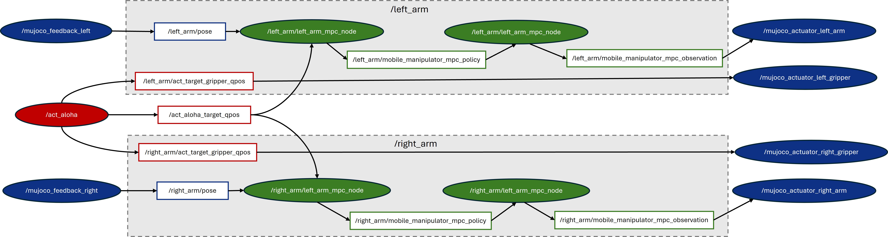
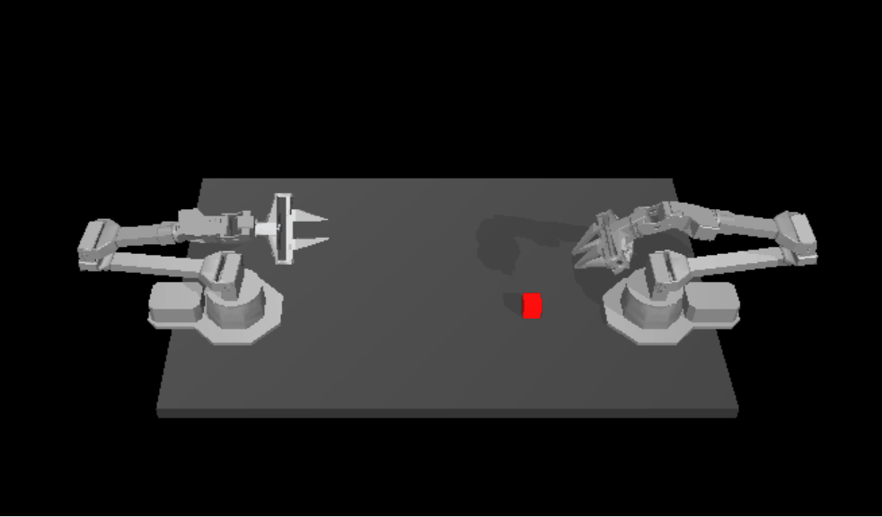

<!--
Copyright (C) 2025 Intel Corporation

SPDX-License-Identifier: Apache-2.0
-->

# Model Predictive Control

Model predictive control (MPC) is an advanced method of process control that is used to control a process while satisfying a set of constraints. Model predictive controllers rely on dynamic models of the process, most often linear empirical models obtained by system identification. The main advantage of MPC is the fact that it allows the current timeslot to be optimized, while keeping future timeslots in account. Also MPC has the ability to anticipate future events and can take control actions accordingly. These features can benefit current model-based robotics control in Perception-Action frequency gap, unsmoothness of generated trajectories, and potential collision.

Here, we adopted an open-source MPC project named Optimal Control for Switched Systems (OCS2) and built a complete pipeline consisting of AI reference model(ACT), MPC(OCS2), and simulation(MUJOCO). The picture below shows the ROS node/topic graph of this demo with three modules: ACT AI model module (marked as red), OCS2 MPC optimization module (marked as green), and Mujoco simulation module (marked as blue).




## Prerequisites

Please make sure you have finished setup steps in [Installation & Setup](https://docs.openedgeplatform.intel.com/edge-ai-suites/robotics-ai-suite/main/embodied/installation_setup.html).


## ACT Setup

The required ACT module is based on the open-source [ACT](https://github.com/tonyzhaozh/act) repository and patches from 0001 to 0006 in [act-ov](../act-sample/patches/ov/) are needed:

| Patch num | Enhancement                  |
| --------- | ---------------------------- |
| 001 - 005 | Intel® OpenVINO™             |
|    006    | Add ROS2 node                |

To set up the required ACT module, please follow the ACT installation guide in the [imitation learning ACT documentation](../act-sample/README.md). Then, after installing and validating ACT-OV, you need to install rclpy in your act virtual environment and apply [006 patch]([act-ov](../act-sample/patches/ov/0006-add-ros2-node-and-use-fixed-cube-pose.patch)).

```
source [your path to act venv]/bin/activate
pip install rclpy
git am 0006-add-ros2-node-and-use-fixed-cube-pose.patch
```


## OCS2 setup

The required MPC module is based on the open-source project [OCS2](https://github.com/leggedrobotics/ocs2). OCS2 is a C++ toolbox tailored for Optimal Control for Switched Systems (OCS2). It provides an efficient implementation of Continuous-time domain constrained DDP (SLQ) and many other helpful algorithms. To facilitate the application of OCS2 in robotic tasks, it provides the user with additional tools to set up the system dynamics (such as kinematic or dynamic models) and cost/constraints (such as self-collision avoidance and end-effector tracking) from a URDF model. Your can go to [OCS2 official web](https://leggedrobotics.github.io/ocs2/overview.html) for more details.

It should be noted that the original OCS2 project is based on ROS1 Noetic, so the following two patches are provided to migrate OCS2 to ROS2 humble and enable it on ACT Aloha:

| Patch num | Enhancement                                                          |
| --------- | -------------------------------------------------------------------- |
|    001    | Migrate mobile manipulation packages from ROS1 Noetic to ROS2 Humble |
|    002    | Modify for ACT dual-arm Aloha                                        |


### Install ROS2 Humble

Please refer to the [official ROS2 Humble installation](https://docs.ros.org/en/humble/Installation/Ubuntu-Install-Debs.html).

### Install OCS2

1. Install dependencies:

```
# install basic library
sudo apt-get install -y \
libglpk-dev \
libmpfr-dev \
libglfw3 \
libglfw3-dev \
libosmesa6 \
freeglut3-dev \
mesa-common-dev \
python3-pip \
python3-wstool \
wget
      
# install ros2 library
sudo apt-get install -y \
ros-humble-pinocchio \
ros-humble-hpp-fcl \
ros-humble-joint-state-publisher
```

2. Create workspace for ocs2 and ocs2_robotic_assets:

```
source /opt/ros/humble/setup.bash
mkdir -p ~/ocs2_ws/src
cd ~/ocs2_ws/src
```

3. Get ocs2 and ocs2_robotic_assets:

Download [ocs2](./ocs2/) and [ocs2_robotic_assets](./ocs2_robotic_assets/) with `git clone --recursive`. Then, initialize submodules and apply patches:

```
cd ocs2
./install_ocs2_patches.sh patches/ocs2.scc
```

```
cd ocs2_robotic_assets
./install_ocs2_robotic_assets_patches.sh patches/ocs2_robotic_assets.scc
```

4. Build ocs2 and ocs2_robotic_assets:

```      
# rosdep
rosdep update --rosdistro humble
rosdep install --from-paths src --ignore-src -r -y
# build
source /opt/ros/humble/setup.bash
colcon build --packages-skip mujoco_ros_utils --cmake-args -DCMAKE_BUILD_TYPE=Release 
```

## MUJOCO setup

The required Mujoco module is based on the open-source Mujoco Plugin project [MujocoRosUtils ](https://github.com/isri-aist/MujocoRosUtils/tree/main) to visualize and simulate the ACT cube transmitting task in Mujoco 2.3.7. Installation guide is as follows:

1. Download Mujoco 2.3.7 library:
```
wget https://github.com/deepmind/mujoco/releases/download/2.3.7/mujoco-2.3.7-linux-x86_64.tar.gz
mkdir ~/.mujoco
tar -zxvf mujoco-2.3.7-linux-x86_64.tar.gz -C ~/.mujoco/
rm -fr mujoco-2.3.7-linux-x86_64.tar.gz
```

2. Download MujocoRosUtils:

Download [mujoco_ros_utils](./mujoco_ros_utils/) with `git clone --recursive`. Then, initialize submodules and apply patches:

```
cd mujoco_ros_utils
./install_mujoco_ros_utils_patches.sh patches/mujoco_ros_utils.scc
```

3. Build MujocoRosUtils
```
source /opt/ros/humble/setup.bash
source ~/ocs2_ws/install/setup.bash
cd ~/ocs2_ws
colcon build --packages-select mujoco_ros_utils --cmake-args -DCMAKE_BUILD_TYPE=RelWithDebInfo -DMUJOCO_ROOT_DIR=~/.mujoco/mujoco-2.3.7
```


## Run pipeline

1. Run Mujoco:

Open new terminal and run the following commands:

```
source /opt/ros/humble/setup.bash
cd ~/.mujoco/mujoco-2.3.7/bin
./simulate ~/ocs2_ws/src/MujocoRosUtils/xml/bimanual_viperx_transfer_cube_dual_arm.xml
```

If running successfully, the mujoco UI will display two opposing ALOHA robotic arms. If you observe collisions between the arms, don't worry; this is normal before initialization.

2. Run MPC:

Open new terminal and run the following commands:

```
source /opt/ros/humble/setup.bash
source ~/ocs2_ws/install/setup.bash
ros2 launch ocs2_mobile_manipulator_ros manipulator_aloha_dual_arm.launch.py
```

If launching successfully, the OCS2 terminal will print out information indicating that two MPC nodes have been successfully reset, and the Mujoco AI will be initialized, as shown in the figures below.


3. Run ACT:

You can download our pre-trained weights from transmitting cube task and set the argument ``--ckpt_dir`` to the path of the pre-trained weights. Then, open new terminal and run the following commands:

```
# env
source /opt/ros/humble/setup.bash
source ~/ocs2_ws/install/setup.bash
source [path to your act venv]/bin/activate

# run act-ov on GPU
cd [your path to act]
MUJOCO_GL=egl python3 imitate_episodes.py --task_name sim_transfer_cube_scripted --ckpt_dir [your path to checkpoints] --policy_class ACT --kl_weight 10 --chunk_size 100 --hidden_dim 512 --batch_size 8 --dim_feedforward 3200 --num_epochs 2000  --lr 1e-5 --seed 0 --eval --onscreen_render --device GPU
```

After ACT running successfully, the Mujoco UI appears as follows:



